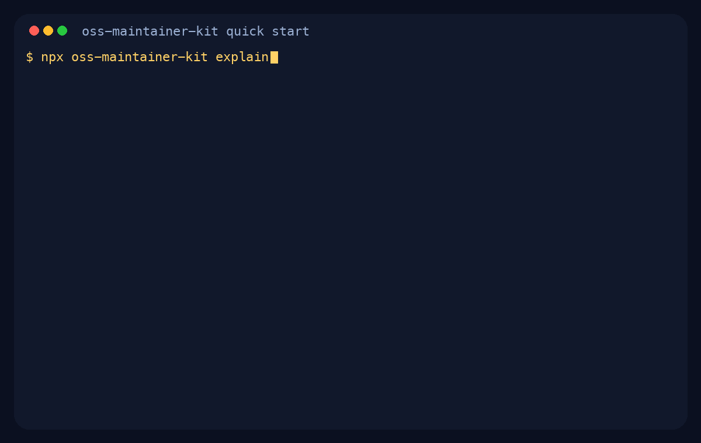

# OSS Maintainer Kit

[](https://www.npmjs.com/package/oss-maintainer-kit)
[](https://www.npmjs.com/package/oss-maintainer-kit)


[](https://github.com/BlakeHampson/oss-maintainer-kit-example)
[](https://github.com/BlakeHampson/oss-maintainer-kit-javascript-example)
[](https://github.com/BlakeHampson/oss-maintainer-kit-python-example)
[](https://github.com/BlakeHampson/oss-maintainer-kit-docs-example)
[](https://github.com/BlakeHampson/oss-maintainer-kit-nextjs-example)
[](https://github.com/BlakeHampson/oss-maintainer-kit-python-service-example)
[](https://github.com/BlakeHampson/oss-maintainer-kit-security-sensitive-example)
[](https://github.com/BlakeHampson/oss-maintainer-kit-security-web-service-example)

Turn a code repository into a public project that other people can understand, review, and contribute to.

If you can already get software working with Codex, Claude Code, or by hand, but GitHub and open-source process still feel confusing, this kit fills in the repository setup that usually gets skipped. It gives you the structure around your code: contributor forms, pull request prompts, repo instructions for AI reviewers, and optional Codex workflows.

In this repo, "maintainer" just means the person responsible for the project. If you are working solo, that is you.

It ships with a tiny CLI and a practical starter pack:

- `AGENTS.md` guidance that helps AI reviews fit your repo
- `docs/START_HERE.md` so a new repo owner knows what to do first
- GitHub issue and pull request templates
- an optional repo-health workflow that runs low-risk checks like `check-docs`
- app-oriented CI smoke-test workflow starters for Next.js apps and Python services
- example Codex GitHub Action workflows for pull request review and release prep
- a repeatable label sync command for first-pass GitHub triage labels
- a local docs check command for broken Markdown links and anchors
- plain-English workflow documentation you can drop into a new or existing repository

## What this solves

Most new public repos have the same gap:

- the code works, but nobody knows how to report a bug well
- pull requests arrive with no context
- AI review tools do not know what matters in the repo
- the owner is still learning GitHub and does not want heavyweight process

OSS Maintainer Kit gives you the minimum useful structure without forcing a giant maintainer handbook on day one.

## What this does in plain English

| File or folder | Why it exists | Do you need it on day one? |
| --- | --- | --- |
| `docs/START_HERE.md` | Explains the generated files and what to do first. | Yes |
| `AGENTS.md` | Tells Codex and contributors what good changes look like in your repo. | Yes |
| `.github/ISSUE_TEMPLATE/*` | Turns vague bug reports and ideas into something you can act on. | Yes |
| `.github/PULL_REQUEST_TEMPLATE.md` | Helps contributors explain what changed and how they checked it. | Yes |
| `.github/release-note-schema.yml` | Optional schema for teams that want machine-readable release prep output. | No, delete it unless another tool needs structured release data |
| `.github/workflows/repo-health.yml` | Optional GitHub Action that runs low-risk checks like `check-docs` in pull requests. | Often yes, especially for docs-heavy or security-sensitive repos |
| `.github/workflows/codex-pr-review.yml` | Optional GitHub Action that asks Codex to review pull requests. | Later if you want AI review in Actions |
| `.github/workflows/codex-release-prep.yml` | Optional GitHub Action that drafts release prep notes. | Later, once you actually ship versions |
| `docs/MAINTAINER_WORKFLOW.md` | Explains how issues, pull requests, and releases are handled. | Helpful, but not urgent |

## Who this is for

- solo builders opening up their first public repo
- people doing AI-assisted or "vibe-coded" development who want cleaner GitHub workflows
- experienced maintainers who want a lightweight starter instead of building templates from scratch

## If you are new to GitHub or open source

- You do not need outside contributors before this becomes useful.
- You do not need to understand every workflow file immediately.
- You can ignore the release workflow until you start shipping versions.
- Rough-but-clear docs beat perfect docs that never get written.

## Quick start

See the CLI flow first:



Try it without cloning anything:

```bash
npx oss-maintainer-kit explain
```

If this is your first public repo, start with the lighter preset and preview the files before writing anything:

```bash
npx oss-maintainer-kit init ../my-repo \
  --repo-name my-repo \
  --maintainer "Your Name" \
  --preset first-public-repo \
  --bundle core \
  --dry-run \
  --diff
```

If the preview looks right, apply it:

```bash
npx oss-maintainer-kit init ../my-repo \
  --repo-name my-repo \
  --maintainer "Your Name" \
  --preset first-public-repo \
  --bundle core
```

By default, existing files are left untouched. Add `--force` only if you want to overwrite matching files.

If you are applying the kit to an existing repo and want to preview overwrites before doing anything, use:

```bash
npx oss-maintainer-kit init . --preset base --force --dry-run --diff
```

Then open `docs/START_HERE.md` in the generated repo. That is the fastest path to understanding what just happened.

If you want the full starter, omit `--preset` or set `--preset base`.

If you want a middle ground for app repos, use `--bundle checks` to keep low-risk checks like `repo-health.yml` and `ci-smoke.yml` while skipping Codex automation and release-prep files.

If you want a concrete generated repo to inspect, start with one of these:

- [oss-maintainer-kit-example](https://github.com/BlakeHampson/oss-maintainer-kit-example) for `first-public-repo`
- [oss-maintainer-kit-javascript-example](https://github.com/BlakeHampson/oss-maintainer-kit-javascript-example) for `javascript-library`
- [oss-maintainer-kit-python-example](https://github.com/BlakeHampson/oss-maintainer-kit-python-example) for `python-package`
- [oss-maintainer-kit-nextjs-example](https://github.com/BlakeHampson/oss-maintainer-kit-nextjs-example) for `nextjs-app`
- [oss-maintainer-kit-python-service-example](https://github.com/BlakeHampson/oss-maintainer-kit-python-service-example) for `python-service`
- [oss-maintainer-kit-docs-example](https://github.com/BlakeHampson/oss-maintainer-kit-docs-example) for `docs-heavy`
- [oss-maintainer-kit-security-sensitive-example](https://github.com/BlakeHampson/oss-maintainer-kit-security-sensitive-example) for `security-sensitive-repo`
- [oss-maintainer-kit-security-web-service-example](https://github.com/BlakeHampson/oss-maintainer-kit-security-web-service-example) for a deployable web-service take on `security-sensitive-repo`

## Suggested first hour after setup

1. Read `docs/START_HERE.md`.
2. Edit `AGENTS.md` so it reflects your stack, risk areas, and review priorities.
3. Keep the issue and pull request templates unless they actively get in your way.
4. Commit the generated files.
5. Decide later whether you want the optional OpenAI-powered GitHub Actions.

## Adoption snapshots

This kit is already being used in two different ways:

- Public examples: there are now 8 live example repos covering beginner, package, app, service, docs, and security-sensitive repository shapes, so you can inspect the generated files instead of guessing what a preset does.
- Social surface: each public example repo now ships with a repo-specific social-preview card, so the README hero and upload-ready share asset are deliberate instead of default.
- Private security-sensitive repo: `ShuleDocs`, a secure Microsoft Office add-in project, is using the kit for maintainer onboarding, repo-specific `AGENTS.md` guidance, and GitHub issue and pull request templates without enabling the optional Codex Actions by default.

That split is intentional. The same kit should be useful for a beginner opening a repo to contributors and for a more security-sensitive project that wants better review discipline without immediately adding more automation.

More detail: [docs/CASE_STUDY_SHULEDOCS.md](docs/CASE_STUDY_SHULEDOCS.md)

## Optional workflows

The included GitHub Actions and workflow templates are optional:

- `repo-health.yml` runs low-risk checks like `check-docs` in pull requests and does not require API keys
- `ci-smoke.yml` is scaffolded in the `nextjs-app` and `python-service` presets as a conservative starting point for build, test, and smoke checks, with stack-aware starter defaults for common repo shapes
- `codex-pr-review.yml` posts a Codex review comment on pull requests
- `codex-release-prep.yml` drafts a release summary and checklist
- `release-note-schema.yml` lets that same release-prep flow also emit a machine-readable YAML block when you need it

The app-oriented `ci-smoke.yml` templates are intentionally simple. They are starting points, not full pipelines, and should be edited to match your package manager, test runner, and critical flow. Today they auto-detect npm, pnpm, or yarn starters for app repos, and `uv`, `requirements.txt`, or editable `pyproject.toml` starters for Python service repos.

If you want concrete `SMOKE_COMMAND` examples instead of a blank starting point, see [docs/SMOKE_COMMANDS.md](docs/SMOKE_COMMANDS.md).

The Codex workflows are intentionally conservative and require an `OPENAI_API_KEY` GitHub secret.

If you already use built-in Codex GitHub reviews, you may not want the pull request workflow as well, because it can create duplicate feedback.

If you want structured release output, see [docs/RELEASE_NOTE_SCHEMA.md](docs/RELEASE_NOTE_SCHEMA.md). If you do not, delete `.github/release-note-schema.yml` and keep the simpler Markdown-only path.

## Bundle selection

`--bundle` lets you control how many optional advanced files get scaffolded without changing the preset itself.

Available bundle profiles:

- `preset-default`: keep the preset's current default behavior
- `core`: onboarding files only, with no optional advanced workflows or release schemas
- `checks`: keep low-risk checks like `repo-health.yml` and `ci-smoke.yml` when the preset supports them, but skip Codex automation and release schemas
- `full`: include every optional advanced file the preset can supply, even if the preset is normally lighter by default

Quick chooser:

| If you want... | Use... |
| --- | --- |
| the smallest beginner-friendly setup | `--bundle core` |
| docs and smoke checks, but no Codex or release automation | `--bundle checks` |
| the preset's built-in default behavior | `--bundle preset-default` |
| every optional advanced file the preset can supply | `--bundle full` |

Examples:

```bash
npx oss-maintainer-kit init ../my-repo --preset first-public-repo --bundle core --dry-run --diff
npx oss-maintainer-kit init ../my-repo --preset nextjs-app --bundle checks --dry-run --diff
npx oss-maintainer-kit init ../my-repo --preset security-sensitive-repo --bundle full --dry-run --diff
```

`--dry-run --diff` works the same way with bundle selection. It previews exactly which optional files would appear or disappear before you write anything.

`--dry-run` now also groups preview output into core files versus optional advanced files, so the bundle impact is easier to scan in the terminal.

For the side-by-side file matrix and a concrete `nextjs-app` comparison, see [docs/BUNDLES.md](docs/BUNDLES.md).

## Presets

| Preset | Best for | What changes | Example repo |
| --- | --- | --- | --- |
| `first-public-repo` | first-time public repos and solo builders | leaves out release-prep automation by default | [oss-maintainer-kit-example](https://github.com/BlakeHampson/oss-maintainer-kit-example) |
| `base` | general-purpose repos | includes both optional Codex workflows | scaffold from the main examples if you want the full starter |
| `javascript-library` | JavaScript and TypeScript packages | adds package-focused review guidance and docs | [oss-maintainer-kit-javascript-example](https://github.com/BlakeHampson/oss-maintainer-kit-javascript-example) |
| `python-package` | Python packages and tools | adds packaging and environment-focused guidance | [oss-maintainer-kit-python-example](https://github.com/BlakeHampson/oss-maintainer-kit-python-example) |
| `nextjs-app` | Next.js web apps | adds routing, rendering, env var, deploy guidance, lightweight architecture stubs, and an editable app smoke workflow | [oss-maintainer-kit-nextjs-example](https://github.com/BlakeHampson/oss-maintainer-kit-nextjs-example) |
| `python-service` | Python APIs, workers, and services | adds runtime, config, migration, runbook guidance, lightweight architecture stubs, and an editable service smoke workflow | [oss-maintainer-kit-python-service-example](https://github.com/BlakeHampson/oss-maintainer-kit-python-service-example) |
| `docs-heavy` | docs, guides, and content-heavy repos | adds accuracy, examples, and structure-focused guidance | [oss-maintainer-kit-docs-example](https://github.com/BlakeHampson/oss-maintainer-kit-docs-example) |
| `security-sensitive-repo` | repos where auth, secrets, packaging, or trust boundaries need stricter review discipline | adds security-oriented review guidance, risk-aware PR and issue templates, and disables optional Codex Actions by default | [packaging-heavy example](https://github.com/BlakeHampson/oss-maintainer-kit-security-sensitive-example)<br>[web-service example](https://github.com/BlakeHampson/oss-maintainer-kit-security-web-service-example) |

The `first-public-repo` preset intentionally leaves out release-prep automation by default. If you later want every optional file it can supply, use `--bundle full`.

## Standard label sync

Most repos eventually want the same first-pass labels for triage.

Preview the standard label set on any repo:

```bash
npx oss-maintainer-kit sync-labels BlakeHampson/oss-maintainer-kit --dry-run
```

This command uses the GitHub CLI, so `gh auth status` should show that you are logged in first.

Apply it:

```bash
npx oss-maintainer-kit sync-labels BlakeHampson/oss-maintainer-kit
```

What the standard manifest manages:

- `bug`
- `enhancement`
- `docs`
- `release`
- `good first issue`
- `needs reproduction`
- `blocked`

The sync is intentionally non-destructive. It creates missing labels and updates matching labels, but leaves unrelated labels alone.

More detail: [docs/LABELS.md](docs/LABELS.md)

## Docs checks

If your repo is docs-heavy or security-sensitive, run this after editing Markdown:

```bash
npx oss-maintainer-kit check-docs .
```

It checks local Markdown links and heading anchors so broken navigation gets caught before a PR is merged.

## What this kit does not do

- It does not write application code.
- It does not replace tests or human review.
- It does not guarantee project traction, security, or contributor activity.
- It does not force you into heavyweight process.

## Local development

Run tests:

```bash
npm test
npm run docs:check
npm run previews:render
```

Smoke check the CLI:

```bash
node ./bin/maintainer-kit.js explain
node ./bin/maintainer-kit.js init ../example-repo --preset first-public-repo --bundle core --dry-run --diff
node ./bin/maintainer-kit.js check-docs .
```

## Roadmap

See [ROADMAP.md](ROADMAP.md) for the next set of presets and workflow improvements.

## License

MIT
